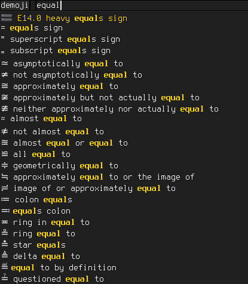

# Demoji #

Character picker for rofi.

Script will push selected character into the clipboard and will type
it in active window.

## Requirements ##

bash, xsel, xdotool

## Rofi ##

Drop repo somewhere.

Symlink desired menus from your ~/bin/ or ~/.local/bin/ direcrories,
or any directory from your path:

    cd ~/bin/
    ln -s ~/path/to/repo/demoji-rofi.sh demoji-unicode.sh
    ln -s ~/path/to/repo/demoji-rofi.sh demoji-emoji.sh
    
Symlink name will be used to figure out which menu you do want.    

You can either call to modi script manually with or use demoji-rofi
script in config:

    rofi.modi:  run,ssh,emoji:~/bin/demoji-emoji.sh,utf:~/bin/demoji-unicode.sh

Then you can switch to this modi with hotkey, `Ctrl+Tab` by default.

Then bind desired calls to keys in your wm, compositor or keyboard manager.

## Fonts ##

Emoji fonts, such as Noto Emoji, are highly recommended for proper
menu rendering.

## See also ## 

<https://github.com/Mange/rofi-emoji>

## Screenshot ##

## List sources ##

[Emoji](https://unicode.org/Public/emoji/)
